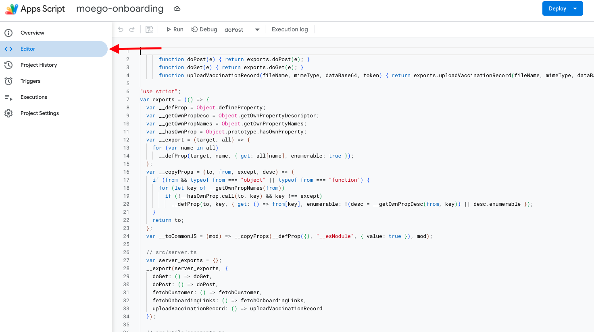
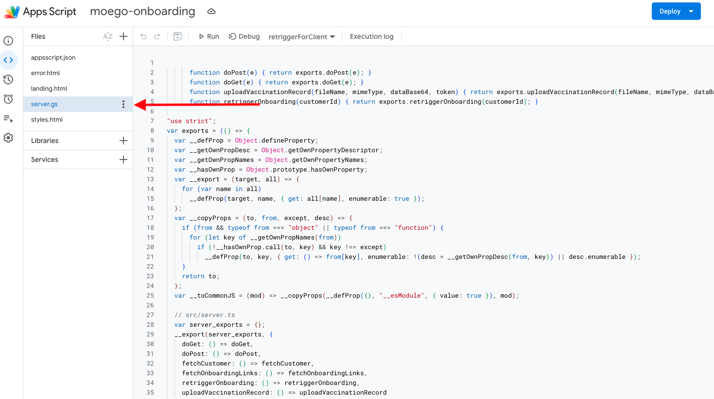
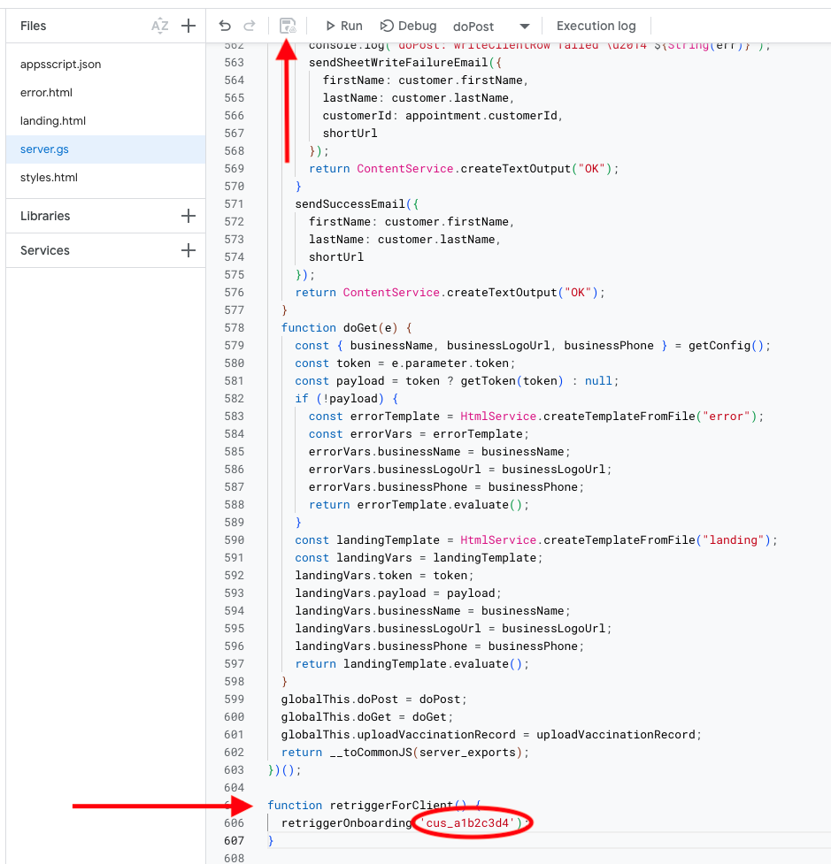
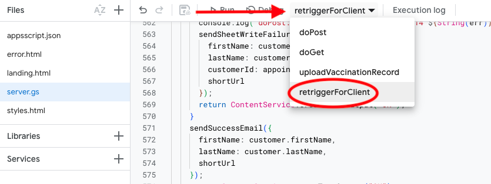
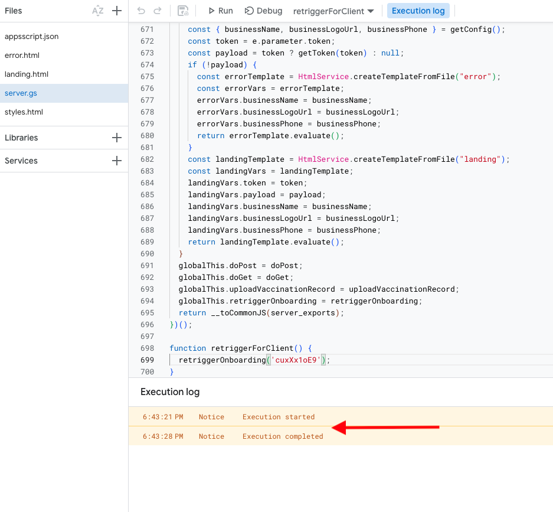

# Re-sending an Onboarding Link — Owner Guide

## When to use this

Use this when a client needs a new onboarding link because:

- Their original link expired (links are valid for 7 days from the time the appointment was created)
- They were booked for a second appointment before completing onboarding on their first, and the system skipped them as a returning client

You will need the client's **Customer ID** from the Google Sheet. Open the sheet and find the client's row by name — their Customer ID is in the **Customer ID** column (column D).

---

## Step 1 — Open the GAS editor

Go to [script.google.com](https://script.google.com) and open the **moego-onboarding** project.

---

## Step 2 — Navigate to the Editor

In the left sidebar, click **Editor** to open the script editor view.



---

## Step 3 — Open the script file

In the file panel on the left side of the editor, click **server.gs** to open the main script file.



---

## Step 4 — Add a temporary wrapper function

Scroll to the very bottom of the file. Add the following, replacing `CUSTOMER_ID_HERE` with the client's actual Customer ID from the sheet:

```javascript
function retriggerForClient() {
  retriggerOnboarding('CUSTOMER_ID_HERE');
}
```

**Example:**

```javascript
function retriggerForClient() {
  retriggerOnboarding('cus_a1b2c3d4');
}
```

Save the file with **Cmd+S** (Mac) or **Ctrl+S** (Windows), or click the save icon in the toolbar.



---

## Step 5 — Select the function and run it

At the top of the editor, click the function dropdown (it may currently show a different function name) and select **retriggerForClient**. Then click the **Run** button to the left of the dropdown.



If this is your first time running a function after a code update, Google may ask you to review and approve permissions. Follow the prompts to authorize the script under your account, then run again.

---

## Step 6 — Check the result

After the function runs, the **Execution log** panel will appear at the bottom of the editor. A successful run looks like this:

```
Execution started
Execution completed
```



If it succeeded:

- You will receive an email with the client's new onboarding link — the same email you receive when a new client is onboarded for the first time
- The client's Onboarding Link and Sent At columns in the sheet will be updated with the new link and timestamp

If something went wrong, you will receive a failure email with details. The execution log will also show the error message — take a screenshot and share it if you need help diagnosing it.

---

## Step 7 — Remove the wrapper function

Once the function has run successfully, delete the wrapper function from the bottom of the file, save again, and close the editor. This keeps the script clean for next time.

---

## Troubleshooting

| Symptom                                                       | Likely cause                                                                                   |
| ------------------------------------------------------------- | ---------------------------------------------------------------------------------------------- |
| You receive a "Links Unavailable" failure email               | MoeGo API call failed — wait a few minutes and try again                                       |
| You receive a "URL Shortening Failed" failure email           | Short.io was unreachable — the email contains the full unshortened link you can send manually  |
| You receive a "Sheet Write Failed" failure email              | Sheet write failed — the client's link was generated successfully; the email contains the link |
| Authorization prompt appears on run                           | Permissions need to be re-approved after a code update — follow the prompts and run again      |
| `retriggerForClient` does not appear in the function dropdown | The file was not saved after adding the wrapper — save with Cmd+S and check the dropdown again |
